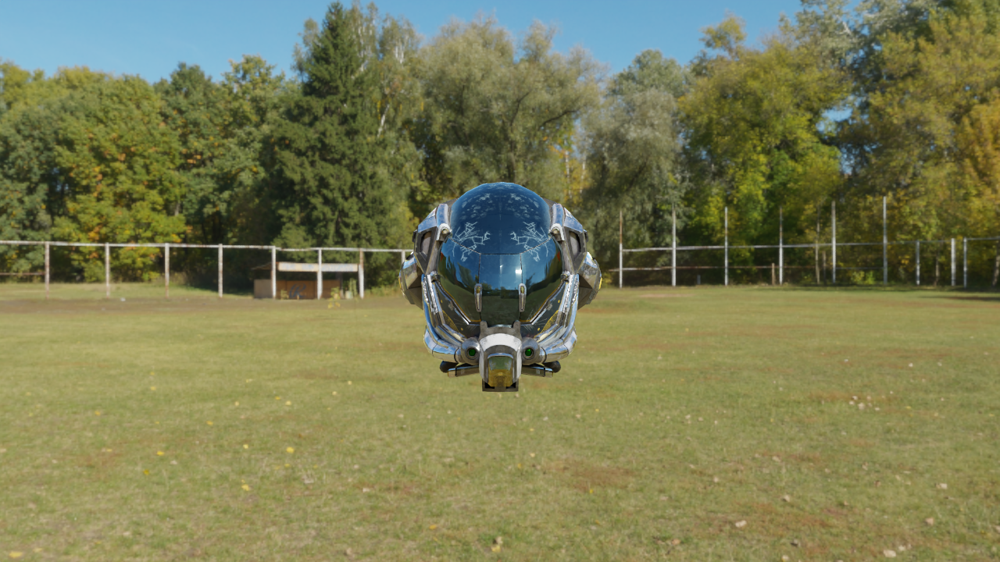
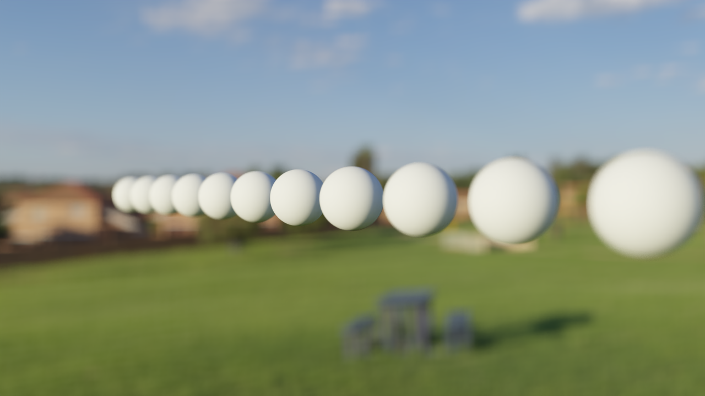
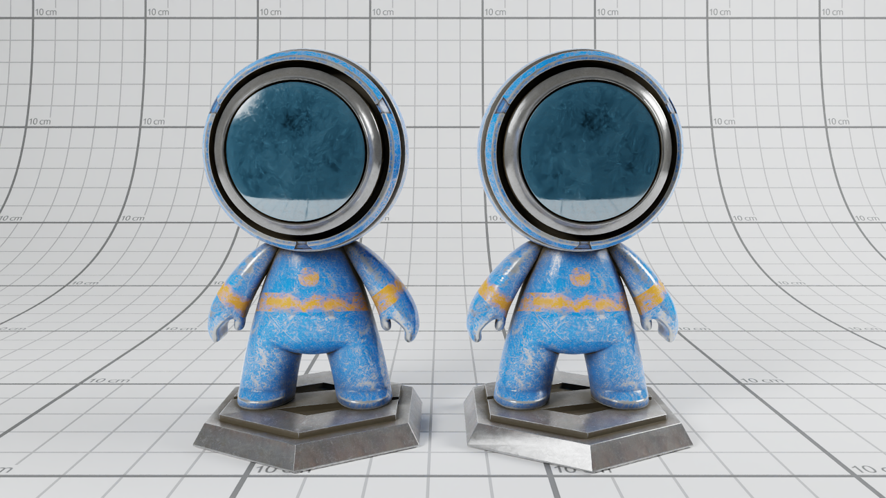
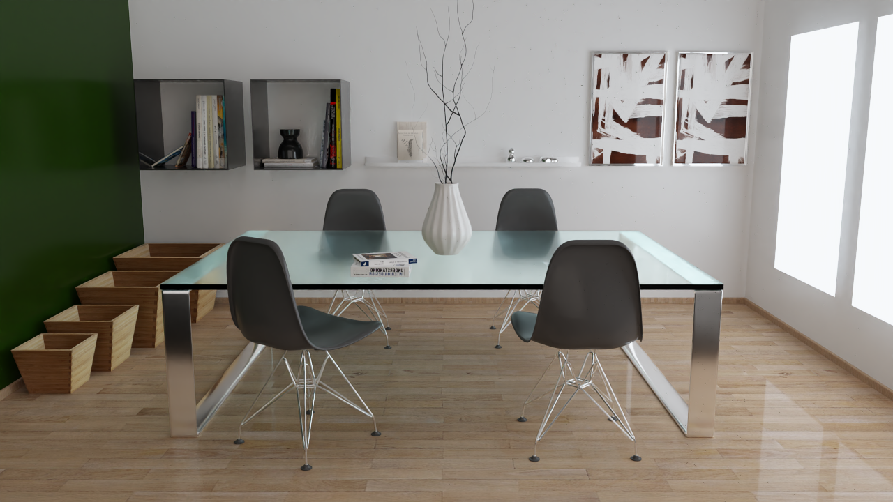
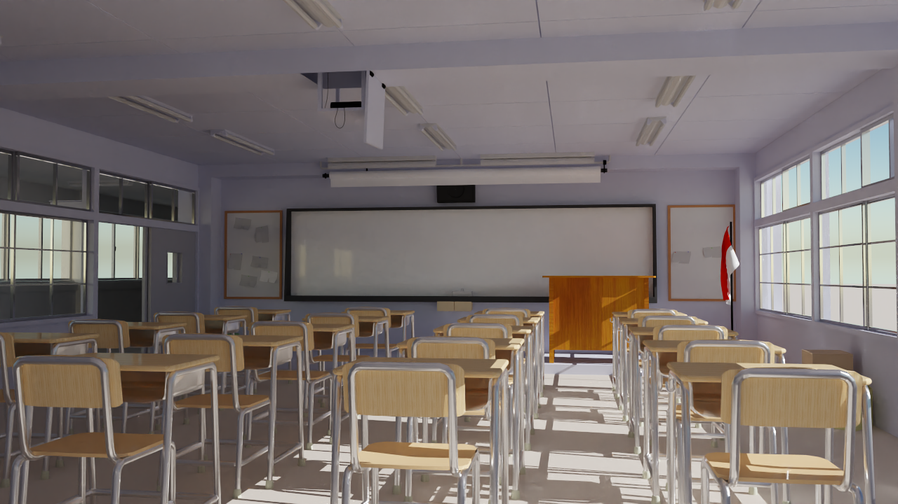

# Fumeng (浮梦)

Fumeng is a hobby project which implements a monte-carlo path tracer from scratch. Fumeng means illusory dream in English.

## Features
### Camera
- [x] Pin-hole camera
- [x] Thin-lens camera (with depth of field)
### Shape
- [x] Sphere
- [x] Rectangle
- [x] Triangle
- [x] OBJ mesh
### Material
- [x] Lambert diffuse
- [x] Specular reflection
- [x] Specular transmission
- [x] Disney BSDF
- [ ] Subsurface scatering
- [ ] Volumetric media
### Light
- [x] Directional light
- [x] Area light
- [x] Image-based light (HDR)
### Accelerator
- [x] Built-in BVH
- [x] [Embree](https://www.embree.org/) BVH (opitional, but highly recommended)
### Ray Tracer
- [x] Basic monte-carlo path tracer
- [ ] Bidirectional path tracer
### Sampling
- [x] Multiple importance sampling
### Denoise
- [x] [OIDN](https://www.openimagedenoise.org/) denoise (opitional, but highly recommended)
### Post process
- [x] Tonemapping
### Texture
- [x] Image texture
- [x] Constant texture
- [ ] Checkerboard
### Scene format
- [x] Custom description using json

## Build and Run
### 1. Download source code
```
git clone --recursive https://github.com/hietwll/Fumeng.git
```
### 2. Install third-party libraries
Both [Embree](https://www.embree.org/) and [OIDN](https://www.openimagedenoise.org/) are optional for Fumeng, but it's strongly recommended to use them. You can just download the pre-built packages from their websites, and extract the packages.

#### Embree: [windows](https://github.com/embree/embree/releases/download/v3.13.3/embree-3.13.3.x64.vc14.windows.zip) and [linux](https://github.com/embree/embree/releases/download/v3.13.3/embree-3.13.3.x86_64.linux.tar.gz)

#### OIDN: [windows](https://github.com/OpenImageDenoise/oidn/releases/download/v1.4.3/oidn-1.4.3.x64.vc14.windows.zip) and [linux](https://github.com/OpenImageDenoise/oidn/releases/download/v1.4.3/oidn-1.4.3.x86_64.linux.tar.gz)

### 3. Config
```
cd /path/to/fumeng
cmake -B build -DCMAKE_BUILD_TYPE=Release -DUSE_FLOAT=TRUE -DUSE_EMBREE=TRUE -DUSE_OIDN=TRUE -Dembree_DIR=/path/to/embree/lib/cmake/embree-x.x.x -DOpenImageDenoise_DIR=/path/to/oidn/lib/cmake/OpenImageDenoise-x.x.x
```
- -DUSE_FLOAT: use single precision if TRUE, use double precision if FALSE
- -Dembree_DIR: directory of embree cmake config file
- -DOpenImageDenoise_DIR: directory of embree cmake config file

### 4. Build
```
cmake --build build --parallel 4 --target CMD_EXE
```
Supported complier:
- VS 2017/2019 for windows
- gcc and clang for linux

### 5. Run
```
cd /path/to/fumeng/scenes
../build/src/cmd/CMD_EXE DamagedHelmet/DamagedHelmet.json
```
result can be found in the same directory of the scene file.

## Scenes
Damaged Helmet:


DoF Camera:


Substance Boy:


Hyperion:


Storm Trooper:


Dining Room:


Classroom:


